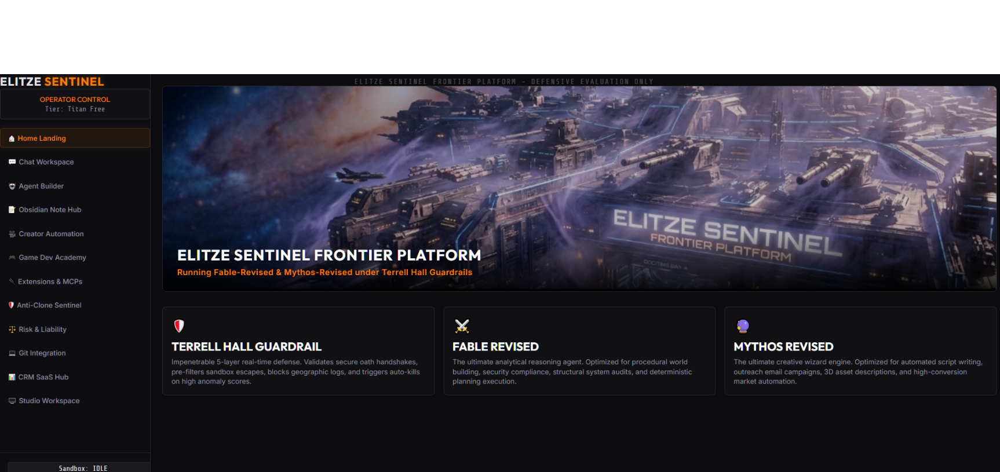

# Elitze Sentinel Frontier

A modular AI orchestration platform for prompt engineering, workflow automation, and real-time data processing. Built for developers who need structured control over LLM-driven pipelines without sacrificing flexibility.

## Capabilities

- **Intelligent Prompt Compilation** — Raw user input is parsed, gap-analyzed, and assembled into structured, executable prompts via a LangGraph state machine
- **LLM-Enhanced Processing** — Optional integration with Anthropic, OpenAI, or local models for deeper intent extraction
- **Real-Time Execution Dashboard** — Next.js interface with live trace logging and step-by-step task visibility via WebSocket streaming
- **Background Task Queue** — BullMQ-powered job processing with Docker sandboxing, Git repository cloning, and command execution
- **Extensible Architecture** — Modular agent graph with pluggable LLM nodes, ready for custom phase injection
- **One-Command Infrastructure** — Spin up PostgreSQL (pgvector), Redis, Keycloak, MinIO, Prometheus, and OpenSearch with Docker Compose

## Quick Start

```bash
# Start infrastructure
docker compose up -d

# Launch the frontend
cd frontend
npm install && npm run dev

# Launch the backend
cd backend
npm install && npm run dev

# Run the Python agent
pip install -r requirements.txt
python main.py "your prompt"
```



## Tech Stack

Frontend: Next.js, TypeScript, tRPC, Tailwind CSS, Framer Motion, React Flow
Backend: Fastify, Prisma, BullMQ, Socket.IO
Agent: LangGraph, LangChain, FastAPI, WebSockets
Infrastructure: PostgreSQL (pgvector), Redis, Keycloak, MinIO, Prometheus, OpenSearch

## License

MIT
